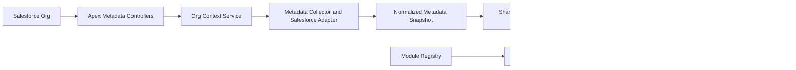

# Salesforce Administration Workspace

> A modular Salesforce workspace for exploring org metadata, evaluating org
> health, explaining configuration, and supporting common administration
> workflows with deterministic analysis.


This repository is a portfolio project demonstrating Salesforce administration,
Lightning Web Component development, Apex metadata services, and explainable
rules-based analysis. The current implementation does **not** use generative AI.
Optional, governed AI enhancements are part of the future roadmap.

## Why I Built This

Salesforce administrators often work across multiple browser tabs, Setup pages,
Object Manager, Flows, Validation Rules, Reports, documentation, and
spreadsheets just to understand how an organization is configured. I wanted to
build a unified administration workspace that brings these activities together
in one connected experience.

Instead of building isolated utilities, this project demonstrates how multiple
Salesforce administration workflows can share a common metadata foundation,
reusable services, contextual navigation, and deterministic recommendations.
The workspace is intended to help administrators:

- Understand an unfamiliar Salesforce org
- Prioritize administrative work
- Explain metadata in business language
- Analyze automation and evaluate org health
- Plan changes before building
- Troubleshoot issues
- Navigate between related workspaces without losing context

## Problem Statement

Salesforce administrators often have to move between Setup pages, metadata
tools, documentation, and troubleshooting resources to understand an org.
Important context can be difficult to assemble: which objects and fields exist,
how configuration is related, where metadata coverage is incomplete, and what
should be reviewed before making a change.

The Salesforce Administration Workspace brings these activities into a modular
Lightning experience. It retrieves supported Salesforce metadata, normalizes it
into shared models, and applies deterministic rules and scoring so that results
remain traceable to known inputs.

## Current Features

| Capability                              | Current implementation                                                                                                                                                                       |
| --------------------------------------- | -------------------------------------------------------------------------------------------------------------------------------------------------------------------------------------------- |
| **Salesforce Copilot Dashboard**        | Mission Control with organization health, priority and action counts, analysis recency, a compact Daily Brief preview, featured planning, and focused workspace navigation.                  |
| **Admin Task Center**                   | Reusable dashboard section that presents high-priority and recommended actions from shared deterministic analysis, registry-derived quick launches, and a source-aware activity placeholder. |
| **Daily Brief**                         | Operations Center with executive summary, priority queue, recommended actions, documentation gaps, readiness, findings, suggested workspace, and end-of-day checklist.                       |
| **Workspace Router**                    | Registry-backed dynamic navigation layer that composes the available administration workspaces through one routing contract.                                                                 |
| **Ask Before You Build**                | Guided deterministic workflow for framing a proposed Salesforce change, affected users, consultant considerations, tests, and related workspaces.                                            |
| **Explain This**                        | Deterministic explanations, risks, dependencies, testing guidance, and deployment considerations, with contextual handoff from supported findings and recommendations.                       |
| **Flow Intelligence**                   | Implemented analysis workspace for Flow-oriented guidance. Its current workspace output is deterministic demonstration content rather than end-to-end live Flow analysis.                    |
| **Live Flow metadata foundation**       | Apex and JavaScript services retrieve Flow inventory and version context from `FlowDefinitionView` and `FlowVersionView`.                                                                    |
| **Org Explorer**                        | Live exploration of Salesforce objects, fields, relationships, record types, and access characteristics.                                                                                     |
| **Org Health Dashboard**                | Metadata-backed health categories, findings, recommendations, and coverage-aware analysis.                                                                                                   |
| **Knowledge Center**                    | Workspace for understanding normalized organization metadata, findings, scores, recommendations, trends, and analysis coverage.                                                              |
| **All Tools**                           | Registry-driven directory containing the complete available and planned workspace catalog.                                                                                                   |
| **Developer Tools**                     | Dedicated technical workspace for diagnostics, routing, metadata cache, registry, verified-history availability, and source coverage.                                                        |
| **Shared Org Knowledge Layer**          | Reusable normalization, deterministic rules, scoring, findings, and recommendation services.                                                                                                 |
| **Metadata Coverage Panel**             | Reusable presentation of complete, partial, unavailable, and unsupported metadata coverage.                                                                                                  |
| **Automation Advisor**                  | Rules-based recommendations for selecting Salesforce automation approaches from a stated business requirement.                                                                               |
| **Troubleshooting Assistant**           | Deterministic issue classification with investigation steps, likely causes, tests, and recommended actions.                                                                                  |
| **Org Context Service**                 | Shared Apex-backed access to organization, object, field, relationship, record-type, access, and Flow context.                                                                               |
| **Salesforce Metadata Collector**       | Collection planning, coverage calculation, Salesforce-specific adaptation, and normalized snapshot creation.                                                                                 |
| **Reusable Org Health summary metrics** | Shared Lightning Web Component for consistently presenting Org Health summary cards.                                                                                                         |

The repository also contains early, disabled prototypes for a Documentation
Generator and an AI Learning Coach. They are not included in the current feature
set.

## Workspace Gallery

The gallery uses sanitized demo-org data and shows the connected administration
experience:

1. **Mission Control** — Today's Brief Summary, Org Health Snapshot, featured
   planning, Primary Actions, Explore More, and Developer Tools.
   
2. **Daily Brief** — Executive Summary, Priority Queue, Recommended Actions,
   Documentation Gaps, Deployment Readiness, Recent Findings, Suggested
   Workspace, and End-of-Day Checklist.
   
3. **Org Health Dashboard** — Health and category scores, deployment readiness,
   findings, prioritized recommendations, and Daily Brief integration.
   
4. **Knowledge Center** — Metadata coverage, organization summary, health
   findings, trend analysis, deployment readiness, and shared intelligence.
   
5. **Explain This** — Business and technical context, dependencies, risks,
   testing guidance, improvements, and contextual launches from supported
   recommendations.
   
6. **Flow Intelligence** — Structured Flow summaries, business purpose,
   walkthroughs, risks, testing checklists, and deterministic suggestions.
   
7. **Ask Before You Build** — Business problem framing, affected users,
   consultant considerations, tests, and deployment guidance.
   
8. **All Tools** — Registry-driven directory and quick navigation for every
   available or planned workspace.
   
9. **Developer Tools** — Workspace registry, metadata cache, routing, source
   coverage, verified-history availability, and metadata diagnostics.
   

No production-org identifiers, usernames, email addresses, customer data, or
confidential metadata should appear in published screenshots.

## Architecture Overview


The current architecture separates Salesforce data access, normalization,
deterministic analysis, and presentation:



### Data and analysis layers

- **Apex controllers** retrieve supported live Salesforce Describe and Flow
  metadata.
- **Org Context Service** provides reusable JavaScript access to Apex-backed
  metadata.
- **Salesforce Metadata Collector** creates coverage-aware, normalized
  snapshots while preserving unavailable and partial-data states.
- **Org Knowledge Layer** converts snapshots into profiles, findings,
  recommendations, and health metrics.
- **Copilot Intelligence services** provide deterministic explanation,
  dependency, risk, test-plan, and interview-guidance functions.
- **Lightning workspaces** present the results through focused administration
  experiences.

Metadata support is intentionally explicit. Object, field, relationship,
record-type, access, and Flow inventory foundations exist today; broader
security, Apex, analytics, sharing, and change-history collection remains future
work.

For more detail, see
[Salesforce Copilot Architecture](docs/SALESFORCE_COPILOT_ARCHITECTURE.md).

## Technology Stack

- Salesforce DX project structure
- Lightning Web Components
- Apex
- Salesforce Schema Describe
- Salesforce Metadata API
- SOQL
- `FlowDefinitionView` and `FlowVersionView`
- Salesforce CLI
- JavaScript
- HTML
- CSS
- XML
- SLDS and Lightning base components
- Visual Studio Code
- Jest with `@salesforce/sfdx-lwc-jest`
- ESLint
- Prettier
- Git and GitHub

No generative-AI provider or Agentforce integration is required or currently
implemented.

## Technical Highlights

- Shared, cached metadata snapshot architecture
- Context-aware workspace routing and context preservation
- Registry-driven navigation and workspace composition
- Reusable deterministic recommendation engine
- Modular Lightning Web Components and shared services
- Coverage-aware analysis that preserves partial and unavailable data states

## Testing

The project uses Jest component testing, ESLint, Prettier, shared deterministic
services, reusable routing, and cached metadata validation. Test coverage is
still being expanded; Apex test classes and broader behavioral LWC coverage are
explicit roadmap items rather than completed claims.

## Project Structure

```text
salesforce-ai-lab/
├── force-app/main/default/
│   ├── classes/                   # Apex metadata controllers
│   ├── lwc/                       # Workspaces, services, and shared components
│   └── objects/                   # Salesforce metadata included in the project
├── docs/                          # Architecture and project documentation
├── projects/salesforce-copilot/  # Earlier product and capability documents
├── config/                        # Scratch-org configuration
├── scripts/                       # Example Apex and SOQL scripts
├── FEATURE_REGISTRY.md            # Detailed capability status
├── PROJECT_STATUS.md              # Current milestone and technical debt
├── AI_CONTEXT.md                  # Engineering principles and contributor context
└── sfdx-project.json              # Salesforce DX project configuration
```

The primary implementation is under `force-app/main/default/lwc` and
`force-app/main/default/classes`.

## Current Roadmap

Near-term work focuses on making the deterministic metadata-to-insight path
reliable and portable:

1. Validate recommendation-to-workspace mappings and pre-build guidance against
   representative Salesforce administration scenarios.
2. Connect the Flow Intelligence workspace to the live Flow metadata foundation.
3. Add a verified change-history source before populating Recent Activity.
4. Expand meaningful LWC behavioral tests and add Apex test classes.
5. Validate health scores, findings, and metadata coverage against known org
   configurations.
6. Standardize loading, empty, partial-data, and error states.
7. Define and test a least-privilege permission model.
8. Validate deployment in a clean second Salesforce org.
9. Document supported metadata, installation requirements, and known limits.

Current implementation status and limitations are tracked in
[PROJECT_STATUS.md](PROJECT_STATUS.md) and
[FEATURE_REGISTRY.md](FEATURE_REGISTRY.md).

## Future AI Roadmap

AI is a planned enhancement layer, not a current dependency or product
capability.

Future exploration may add a provider-neutral, governed gateway that receives
structured results from the deterministic core. Potential enhancements include:

- Grounded summaries of verified findings
- Audience-specific explanations
- Follow-up questions based on collected metadata
- Draft documentation and release notes
- Learning and interview coaching based on known workspace context
- Change-impact analysis and deployment planning
- Agentforce integration through the governed AI gateway
- MCP integrations and GitHub intelligence
- A reusable prompt library
- Trend analytics and a release-readiness dashboard

Any future AI mode should preserve source context, respect metadata coverage,
degrade safely when no provider is configured, and leave every core
administration workflow usable without generative AI.

## Getting Started

This repository is currently a Salesforce DX development project, not a
validated managed or unlocked package. The following steps are intended for
development and evaluation.

### Prerequisites

- A Salesforce org suitable for development
- Salesforce CLI
- Node.js and npm
- Git

The project uses Salesforce API version `66.0`. Confirm that the target org and
installed Salesforce CLI support that version before deployment.

### Local setup

```shell
git clone <repository-url>
cd salesforce-ai-lab
npm ci
sf org login web --alias salesforce-ai-lab
```

### Validate and deploy

Run the local quality checks:

```shell
npm run prettier:verify
npm run lint
npm run test:unit
```

Deploy the Salesforce source to the authorized org:

```shell
sf project deploy start --source-dir force-app --target-org salesforce-ai-lab
```

After deployment, add the exposed **Salesforce Copilot Dashboard** Lightning Web
Component to a Lightning App, Home, or Record page through Lightning App
Builder.

Clean-org installation, permission-set design, Apex test coverage, and
production deployment have not yet been formally validated. Review the current
status and source before using the project outside a development environment.

## Lessons Learned

Building this project strengthened practical understanding of Salesforce
architecture, Lightning Web Components, metadata-driven design, component
communication, shared services, UI/UX design, product thinking, Git workflows,
test-driven development, and professional documentation.

## About This Project

This repository is an ongoing Salesforce portfolio project. The current goal is
to build production-quality Salesforce administration tools while deepening
knowledge of the Salesforce platform, software architecture, and modern CRM
operations. The long-term vision is a comprehensive Salesforce Administration
Workspace that combines transparent deterministic metadata analysis with
optional future AI-assisted workflows while remaining explainable and focused
on administrator needs.
