# Salesforce Copilot Architecture

## Platform Purpose

Salesforce Copilot is a modular administration workspace designed to help Salesforce administrators, business analysts, consultants, and future architects understand an org, troubleshoot issues, evaluate changes, recommend solutions, prepare deployments, document work, and strengthen their Salesforce skills.

The platform is designed to operate in two modes:

- **Core Mode:** Uses Salesforce metadata, Apex, JavaScript, deterministic rules, and explainable scoring.
- **AI-Enhanced Mode:** Adds optional generative explanations, conversational assistance, summarization, and grounded recommendations.

The core platform does not require generative AI to function.

---

# High-Level Architecture

```mermaid
flowchart TB

    SF[Salesforce Organization]

    subgraph Metadata["Salesforce Metadata and Runtime Context"]
        OBJECTS[Objects and Fields]
        RELATIONSHIPS[Relationships and Record Types]
        FLOWS[Flows]
        RULES[Validation and Duplicate Rules]
        SECURITY[Profiles and Permission Sets]
        CODE[Apex Classes and Triggers]
        ANALYTICS[Reports and Dashboards]
        DEPLOYMENTS[Deployments and Change History]
    end

    subgraph Core["Core Services"]
        OCC[OrgContextController.cls]
        OCS[Org Context Service]
        CACHE[Cache Service]
        REFRESH[Refresh Service]
        SNAPSHOT[Metadata Snapshot Service]
        CONSTANTS[Copilot Constants and Design Tokens]
    end

    subgraph Knowledge["Shared Org Knowledge Layer"]
        MODELS[Knowledge Models]
        UTILITIES[Knowledge Utilities]
        KNOWLEDGE_RULES[Knowledge Rules]
        SCORING[Knowledge Scoring]
        ORCHESTRATOR[Org Knowledge Service]
    end

    subgraph Intelligence["Copilot Intelligence Layer"]
        EXPLANATION[Explanation Engine]
        DEPENDENCY[Dependency Engine]
        RISK[Risk Engine]
        TESTING[Test Plan Engine]
        INTERVIEW[Interview Engine]
        RECOMMENDATION[Recommendation Logic]
    end

    subgraph Workspaces["User Workspaces and Modules"]
        DASHBOARD[Salesforce Copilot Dashboard]
        FLOW[Flow Intelligence]
        EXPLORER[Org Explorer]
        AUTOMATION[Automation Advisor]
        TROUBLESHOOTING[Troubleshooting Assistant]
        HEALTH[Org Health]
        KNOWLEDGE_VIEWER[Org Knowledge Viewer]
        EXPLAIN[Explain This]
        IMPACT[Change Impact Analyzer]
        READINESS[Deployment Readiness]
        BRIEF[Daily Admin Brief]
        LEARNING[AI Learning Coach]
        DOCUMENTATION[Documentation Generator]
    end

    subgraph OptionalAI["Optional AI Layer"]
        GATEWAY[AI Gateway]
        SALESFORCE_AI[Salesforce AI / Agentforce]
        OPENAI[OpenAI]
        ANTHROPIC[Anthropic]
        GEMINI[Gemini]
        LOCAL[Approved Local or Private Model]
    end

    SF --> Metadata

    Metadata --> OCC
    OCC --> OCS

    OCS --> CACHE
    OCS --> REFRESH
    OCS --> SNAPSHOT

    OCS --> ORCHESTRATOR

    MODELS --> ORCHESTRATOR
    UTILITIES --> ORCHESTRATOR
    KNOWLEDGE_RULES --> ORCHESTRATOR
    SCORING --> ORCHESTRATOR

    ORCHESTRATOR --> EXPLANATION
    ORCHESTRATOR --> DEPENDENCY
    ORCHESTRATOR --> RISK
    ORCHESTRATOR --> TESTING
    ORCHESTRATOR --> INTERVIEW
    ORCHESTRATOR --> RECOMMENDATION

    OCS --> EXPLORER
    ORCHESTRATOR --> HEALTH
    ORCHESTRATOR --> KNOWLEDGE_VIEWER
    ORCHESTRATOR --> EXPLAIN
    ORCHESTRATOR --> IMPACT
    ORCHESTRATOR --> READINESS
    ORCHESTRATOR --> BRIEF

    EXPLANATION --> FLOW
    DEPENDENCY --> IMPACT
    RISK --> TROUBLESHOOTING
    TESTING --> FLOW
    TESTING --> EXPLAIN
    TESTING --> READINESS
    INTERVIEW --> LEARNING
    RECOMMENDATION --> AUTOMATION

    DASHBOARD --> FLOW
    DASHBOARD --> EXPLORER
    DASHBOARD --> AUTOMATION
    DASHBOARD --> TROUBLESHOOTING
    DASHBOARD --> HEALTH
    DASHBOARD --> EXPLAIN
    DASHBOARD --> IMPACT
    DASHBOARD --> READINESS
    DASHBOARD --> BRIEF
    DASHBOARD --> LEARNING
    DASHBOARD --> DOCUMENTATION

    ORCHESTRATOR --> GATEWAY
    GATEWAY --> SALESFORCE_AI
    GATEWAY --> OPENAI
    GATEWAY --> ANTHROPIC
    GATEWAY --> GEMINI
    GATEWAY --> LOCAL

    GATEWAY -. Optional grounded enhancements .-> Workspaces
```



---

# Architecture Layers

## 1. Salesforce Metadata and Runtime Context

This layer represents the live Salesforce organization.

Current supported metadata:

- Organization summary
- Object inventory
- Object capabilities
- Fields
- Relationships
- Record types
- Current-user context

Planned metadata expansion:

- Flows
- Validation Rules
- Duplicate Rules
- Matching Rules
- Permission Sets
- Profiles
- Apex Classes
- Apex Triggers
- Reports
- Dashboards
- Deployment and change history

This layer is the source of truth. The platform should not claim that a dependency or health issue exists unless the required metadata has been retrieved or the result is clearly labeled as an inference.

---

## 2. Core Services

### OrgContextController.cls

Retrieves live Salesforce organization and Describe metadata through Apex.

### orgContextService

Provides reusable JavaScript methods for requesting:

- Organization summaries
- Object inventories
- Detailed object context
- Fields
- Relationships
- Record types

### cacheService

Reduces unnecessary repeated metadata requests.

### refreshService

Coordinates refresh behavior across workspaces.

### metadataSnapshotService

Creates standardized metadata snapshots that can be consumed by shared intelligence services.

### copilotCore

Stores shared constants, labels, configuration, and design tokens.

---

## 3. Shared Org Knowledge Layer

The Org Knowledge Layer turns raw metadata into structured and reusable knowledge.

### knowledgeModels.js

Defines common structures for:

- Organizations
- Objects
- Fields
- Relationships
- Record types
- Findings
- Recommendations
- Health categories
- Deployment readiness

### knowledgeUtilities.js

Provides shared functions for:

- Normalization
- Mapping
- Sorting
- Filtering
- Grouping
- Deduplication
- Formatting
- Score calculations

### knowledgeRules.js

Uses deterministic rules to interpret metadata.

Examples:

- A required field creates elevated change risk.
- A unique external ID may be integration-critical.
- A high field count increases data-model complexity.
- An inaccessible object creates a security finding.
- A disabled rule may require administrative review.

### knowledgeScoring.js

Converts findings into explainable:

- Org Health scores
- Category scores
- Risk levels
- Deployment Readiness scores
- Blocking-issue counts
- Priority metrics

### orgKnowledgeService.js

Orchestrates the complete analysis:

```text
Raw metadata
    ↓
Normalized snapshot
    ↓
Knowledge profiles
    ↓
Rules evaluation
    ↓
Health and readiness scoring
    ↓
Findings, recommendations, and briefings
```

---

## 4. Copilot Intelligence Layer

The Intelligence Layer provides reusable reasoning engines.

### explanationEngine.js

Creates plain-language explanations of Salesforce metadata and configuration.

### dependencyEngine.js

Organizes known dependencies and prepares dependency analysis.

### riskEngine.js

Assigns risk based on metadata, configuration, user impact, and proposed changes.

### testPlanEngine.js

Generates structured testing plans for:

- Flows
- Validation Rules
- Formula Fields
- Custom Fields
- Apex
- Permission Sets
- Duplicate Rules
- Record Types
- Reports
- Dashboards
- Queues
- Roles
- Sharing Rules

### interviewEngine.js

Transforms technical work into:

- Interview explanations
- Scenario questions
- STAR-story prompts
- Administrator and consultant talking points

---

## 5. User Workspaces

### Salesforce Copilot Dashboard

The central navigation and status workspace.

### Flow Intelligence

Analyzes Flow purpose, design, risks, testing needs, documentation, and interview insights.

### Org Explorer

Retrieves and displays live object and field metadata.

### Automation Advisor

Recommends an automation approach based on a Salesforce business requirement.

### Troubleshooting Assistant

Classifies Salesforce issues and provides likely causes, investigation steps, tests, and recommended actions.

### Org Health

Displays explainable organization-health categories, findings, and recommendations.

### Org Knowledge Viewer

A diagnostic workspace used to validate the shared Org Knowledge Layer before full dashboard integration.

### Explain This

Explains the business and technical purpose, risks, dependencies, improvements, tests, and deployment concerns for selected metadata.

### Change Impact Analyzer

Evaluates the potential effect of changing or removing Salesforce configuration.

### Deployment Readiness

Combines health findings, risk, tests, documentation, security review, and rollback planning into a release-readiness assessment.

### Daily Admin Brief

Surfaces current findings, top recommendations, health status, deployment readiness, and eventually verified recent changes.

### AI Learning Coach

Teaches Salesforce concepts, provides scenario practice, supports certification preparation, and helps develop interview responses.

### Documentation Generator

Produces administrator documentation, technical notes, release notes, testing plans, and implementation summaries.

---

# Core Mode and AI-Enhanced Mode

## Core Mode

Core Mode operates using:

- Apex
- Lightning Web Components
- JavaScript
- Salesforce Describe metadata
- Deterministic rule engines
- Explainable scoring

Benefits:

- No external AI dependency
- No generative API expense
- Predictable results
- Easier auditing
- Reduced hallucination risk
- Suitable for organizations with restrictive AI policies

## AI-Enhanced Mode

AI is an optional layer applied after the core analysis.

The AI layer may:

- Explain deterministic findings conversationally
- Summarize complex metadata
- Answer follow-up questions
- Draft documentation
- Generate release notes
- Adapt explanations to beginner, administrator, consultant, or architect audiences
- Provide grounded learning and interview coaching

The AI should receive structured results from the core platform rather than independently inventing configuration facts.

```text
Salesforce metadata
        ↓
Core analysis and rules
        ↓
Verified findings and recommendations
        ↓
Optional AI explanation
```

---

# Portability Across Salesforce Organizations

The product is being designed so that the same package can operate in:

- Developer organizations
- Scratch orgs
- Sandboxes
- Production organizations
- Client organizations
- Nonprofit organizations
- Sales Cloud or Service Cloud implementations

The product should not depend on organization-specific custom objects or hardcoded IDs.

Portability requirements include:

- Dynamic metadata discovery
- Permission Set-based access
- Configurable scan depth
- Safe error handling
- No hardcoded organization identifiers
- No dependency on AI
- Optional provider configuration for AI mode
- Apex and JavaScript tests
- Clean-org installation testing
- Future unlocked-package support

---

# Current Product State

## Working or Deployed

- Salesforce Copilot Dashboard
- Flow Intelligence
- Org Explorer
- Org Context Service
- Org Context Viewer
- Automation Advisor
- Troubleshooting Assistant MVP
- Shared Copilot Core
- Explanation Engine
- Dependency Engine
- Risk Engine
- Test Plan Engine
- Org Knowledge Layer
- Org Knowledge Viewer under validation

## In Progress

- Org Health
- Deployment Readiness
- Daily Admin Brief
- Explain This expansion
- Change Impact Analyzer
- Dashboard integration

## Planned

- AI Learning Coach completion
- Documentation Generator completion
- Full dependency retrieval
- Metadata-change history
- AI Gateway
- Clean second-org deployment
- Unlocked packaging
- Portfolio demonstration

---

# Interview Explanation

I designed Salesforce Copilot as a modular administration platform rather than a single-purpose Lightning component. A shared Org Context Service retrieves live Salesforce metadata, while the Org Knowledge Layer converts that metadata into normalized profiles, deterministic findings, recommendations, health scores, and deployment-readiness results.

Reusable intelligence engines support explanations, dependency analysis, risk evaluation, testing guidance, and interview coaching. The user-facing workspaces consume these shared services, which reduces duplicated logic and makes the platform easier to extend.

The core product works without generative AI. An optional AI gateway can later enhance verified core results with conversational explanations, documentation, and grounded follow-up assistance. This design keeps the platform portable, explainable, and useful in organizations that may not permit external AI.